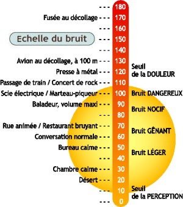
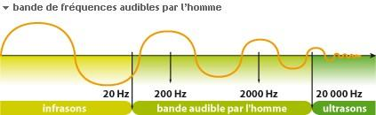
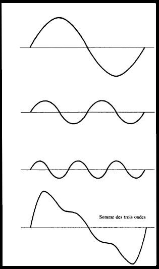
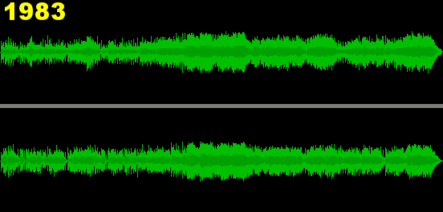

* Pourquoi le montage sonore ?
	* Ambiance
	* Temporalité
	* Expérience
	* Émotions

Sons et perception du son:

* Intensité sonore : volume perçu en décibel

  

* Amplitude :

* Fréquences  (Hauteur du son)

* hauteur (pitch)

	* 440HZ 
<audio controls loop>
    <source src="../mp3/440.mp3" type="audio/mpeg">
    <source src="../ogg/440.ogg" type="audio/ogg">
Your browser does not support the audio element.
</audio>

	* 880HZ 
<audio controls loop>
    <source src="../mp3/880.mp3" type="audio/mpeg">
    <source src="../ogg/880.ogg" type="audio/ogg">
Your browser does not support the audio element.
</audio>

	* 1760HZ 
<audio controls loop>
    <source src="../mp3/1760.mp3" type="audio/mpeg">
    <source src="../ogg/1760.ogg" type="audio/ogg">
Your browser does not support the audio element.
</audio>

	* Sommation des trois ondes  
<audio controls loop>
    <source src="../mp3/440+880+1760.mp3" type="audio/mpeg">
    <source src="../ogg/440+880+1760.ogg" type="audio/ogg">
Your browser does not support the audio element.
</audio>

	

* Rythme/ arythmie
	* Rythme  
<audio controls>
    <source src="../mp3/jongly.mp3" type="audio/mpeg">
    <source src="../ogg/jongly.ogg" type="audio/ogg">
Your browser does not support the audio element. </audio>

	* arythmie  
<audio controls>
    <source src="../mp3/rainstick.mp3" type="audio/mpeg">
    <source src="../ogg/rainstick.ogg" type="audio/ogg">
Your browser does not support the audio element. </audio>

* Spatialisation (Direction /provenance)
	* Stéréophonie
		* Sans Panoramisation
		  <audio controls>
		    <source src="../mp3/rainstick.mp3" type="audio/mpeg">
		    <source src="../ogg/rainstick.ogg" type="audio/ogg">
		Your browser does not support the audio element.
		</audio>
		* Avec Panoramisation
		  <audio controls>
				<source src="../mp3/rainstickPan.mp3" type="audio/mpeg">
				<source src="../ogg/rainstickPan.ogg" type="audio/ogg">
			Your browser does not support the audio element.
		</audio>

	* Effet Doppler (phase+pitch p/r temps = impression de déplacement)
		* exemple : la sirène
	  <audio controls>
		<source src="../mp3/31920__jobro__doppler-siren.mp3" type="audio/mpeg">
		http://www.freesound.org/people/jobro/sounds/31920/
	</audio>

* la forme d'onde (Amplitude/temps)

* Dynamique vs Saturation
	* relation perçue entre les sons forts et les sons faibles au cours d'un morceau
	* [Guerre du volume](http://fr.wikipedia.org/wiki/Guerre_du_volume)

	

		* https://youtu.be/gSwLeLdkYjs
		* https://www.youtube.com/watch?v=Cbu7uwLqunU

pour aller plus loin : lire <a href="http://fr.wikipedia.org/wiki/Psychoacoustique">Psychoacoustique:Wiki</a>

