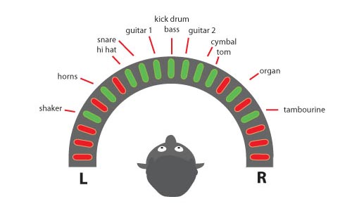
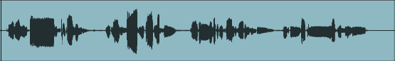

Vocabulaire lié à la perception des phénomènes sonore:

* Intensité (volume-décibel)

  

* Fréquences  (Hauteur du son)

* Rythme/ absence de rythme
	* Rythme
<audio controls>
    <source src="../mp3/jongly.mp3" type="audio/mpeg">
    <source src="../ogg/jongly.ogg" type="audio/ogg">
Your browser does not support the audio element.
</audio>

	* Ø rythme
<audio controls>
    <source src="../mp3/rainstick.mp3" type="audio/mpeg">
    <source src="../ogg/rainstick.ogg" type="audio/ogg">
Your browser does not support the audio element.
</audio>

* Timbre (composition spectrale)

440HZ
<audio controls loop>
    <source src="../mp3/440.mp3" type="audio/mpeg">
    <source src="../ogg/440.ogg" type="audio/ogg">
Your browser does not support the audio element.
</audio>

880HZ
<audio controls loop>
    <source src="../mp3/880.mp3" type="audio/mpeg">
    <source src="../ogg/880.ogg" type="audio/ogg">
Your browser does not support the audio element.
</audio>

1760HZ
<audio controls loop>
    <source src="../mp3/1760.mp3" type="audio/mpeg">
    <source src="../ogg/1760.ogg" type="audio/ogg">
Your browser does not support the audio element.
</audio>

Sommation des trois ondes
<audio controls loop>
    <source src="../mp3/440+880+1760.mp3" type="audio/mpeg">
    <source src="../ogg/440+880+1760.ogg" type="audio/ogg">
Your browser does not support the audio element.
</audio>

* Direction (provenance)
	* Exemple : [Take 5 de Dave Brubeck](http://www.youtube.com/watch?v=vmDDOFXSgAs)
	* Stéréophonie
	
	* Spatialisation (multihauts parleurs)
	* Effet Doppler

* la forme d'onde (Amplitude/temps)

* Dynamique sonore
	* Perception relative douce/forte
	* [Guerre du volume](http://fr.wikipedia.org/wiki/Guerre_du_volume)

pour aller plus loin : lire <a href="http://fr.wikipedia.org/wiki/Psychoacoustique">Psychoacoustique:Wiki</a>

