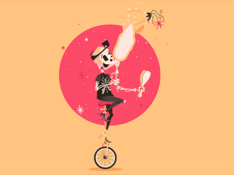

Aram Khachaturian - Sabre Dance : 1953

<audio controls >
    <source src="../mp3/intro_khachaturian.mp3" type="audio/mpeg">
    <source src="../ogg/intro_khachaturian.ogg" type="audio/ogg">
	Your browser does not support the audio element.
</audio> 

Luc Ferrari - Cha-cha-cha : 1991

<audio controls >
    <source src="../mp3/intro_ferrari.mp3" type="audio/mpeg">
    <source src="../ogg/intro_ferrari.ogg" type="audio/ogg">
	Your browser does not support the audio element.
</audio>

Iannis Xenakis - Metastasis : 1955

<audio controls >
    <source src="../mp3/intro_xenakis.mp3" type="audio/mpeg">
    <source src="../ogg/intro_xenakis.ogg" type="audio/ogg">
	Your browser does not support the audio element.
</audio>

 

Pierre Schaeffer - Etude aux sons animés : 1958

<audio controls >
    <source src="../mp3/intro_schaeffer.mp3" type="audio/mpeg">
    <source src="../ogg/intro_schaeffe.ogg" type="audio/ogg">
	Your browser does not support the audio element.
</audio> 