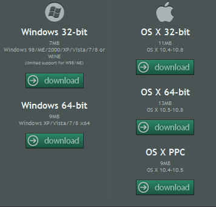
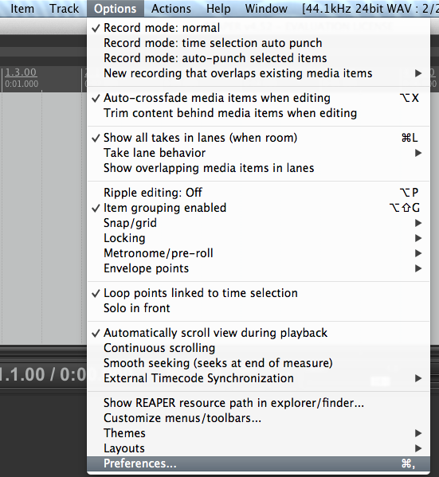
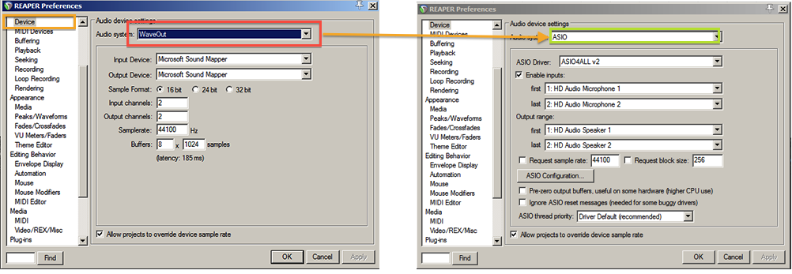
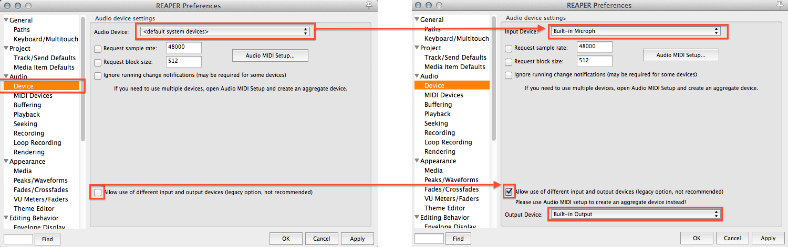
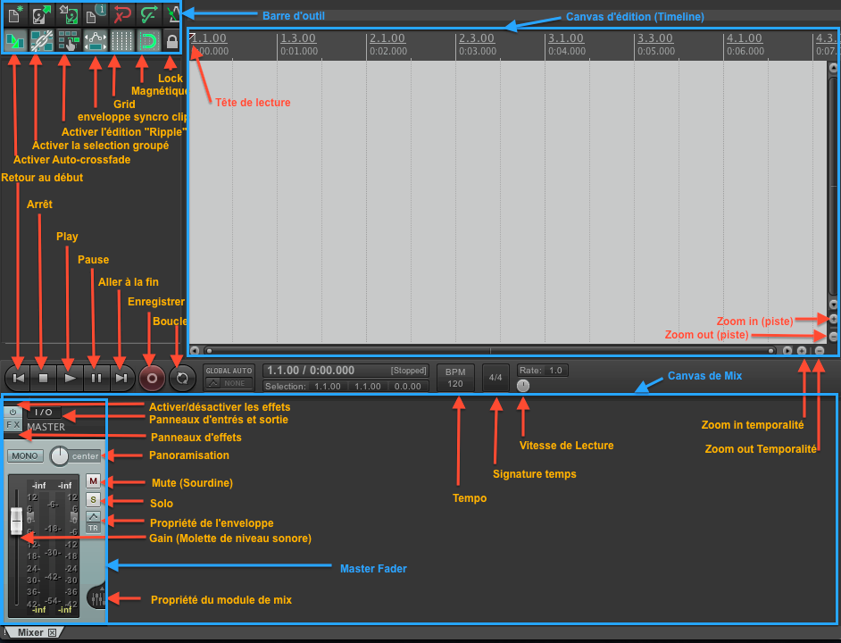

## Installation Reaper

Télécharger REAPER : <a href="http://www.cockos.com/reaper/download.php">http://www.cockos.com/reaper/download.php</a>

Choisir sa plateforme :(Windows/Mac)

Choisir son architecture :
Distinction entre 32 et 64 bits : 64 bits pour les ordinateurs plus récents,  32 bits dans les plus vieux
PPC -> correspond aux Macintosh pré-Intel (&lt;2008?)

<ul>
<li>
Spécificité : Windows

<ol>
<li>
 Installer le pilote <strong><em>Asio4All</em></strong>   
Permets d'avoir des performances accrues et un meilleur contrôle sur la latence

<ul>
<li>Site : <a href="http://www.asio4all.com/">http://www.asio4all.com/</a></li>
<li>Téléchargement : <a href="http://tippach.business.t-online.de/asio4all/downloads_2/ASIO4ALL_2_11_Beta2_English.exe">V2.11-BETA2</a></li>
<li>Tutoriel vidéo <a href="http://www.youtube.com/watch?v=7_qw0-888n8">installer ASIO4ALL</a></li>
</ul>
</li>
<li>
  Installer REAPER

<ul>
<li>  une fois le fichier d'installation téléchargé, exécutez-le,  appuyer sur next jusqu'à ce qu'il installe. C'est fait!</li>
</ul>
</li>
</ol>
</li>
<li>
Mac

<ul>
<li>Télécharger l'image disque (.dmg)</li>
<li>double cliquer sur l'image disque</li>
<li>Une fenêtre surgie : appuyer sur <em>agree</em></li>
<li>Glisser déposer l'icône <em>Reaper</em> vers le dossier application
</li>
</ul>
</li>
</ul>

<h2>Configuration</h2>

<ul>
<li><strong>Windows</strong> :

<ul>
<li>S'assurer d'avoir le pilote <em>asio4all</em> d'installé</li>
<li>Ouvrir Reaper,

<ul>
<li>Si c'est la première fois que Reaper est ouvert,  le programme vous demandera de configurer l'interface audio.  Appuyer sur oui.  Si vous avez esquivez cette question,</li>
</ul>
</li>
<li>Ouvrir le menu <strong><em>Preference</em></strong> dans la barre supérieure <strong><em>Option</em></strong>  
  </li>
<li>Sélectionner <strong><em>device</em></strong> dans la colonne de gauche</li>
<li>Cliquer le menu <strong><em>audio system</em></strong> et sélectionner <strong><em>ASIO</em></strong></li>
<li>Appuyer sur <em>Apply</em> puis <em>OK</em></li>
</ul>
</li>
</ul>

<ul>
<li><strong>Macintosh</strong> :

<ul>
<li>Ouvrir Reaper,

<ul>
<li>Si c'est la première fois que Reaper est ouvert,  le programme vous demandera de configurer l'interface audio.  Appuyer sur oui.  Si vous avez esquivé cette question,</li>
</ul>
</li>
<li>Ouvrir le menu <strong><em>Preference</em></strong> dans la barre supérieure <strong><em>Option</em></strong>  
  </li>
<li>Sélectionner <strong><em>device</em></strong> dans la colonne de gauche</li>
<li>Dans l'éventualité que vous utilisiez la carte interne de l'ordinateur,

<ul>
<li>Cocher l'option <strong><em>Allow use of different input and output devices</em></strong></li>
<li>Sélectionner <strong><em>Built-in Microph</em></strong> dans le menu <strong><em>Input Device</em></strong></li>
<li>Sélectionner <strong><em>Built-in Output</em></strong> dans le menu <strong><em>Output Device</em></strong></li>
</ul>
</li>
</ul>
</li>
</ul>

<h2>Interface</h2>

<ul>
<li><a href="http://www.cockos.com/reaper/guides/REAPER%20Quick%20Start.pdf">Document des raccourcis clavier fournis par Reaper</a></li>
</ul>
