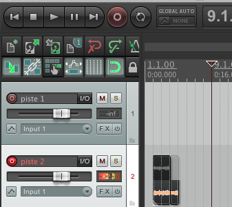
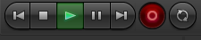
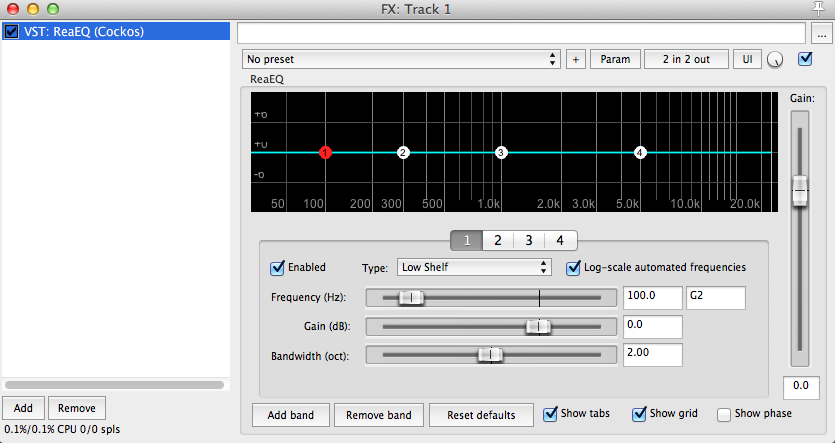
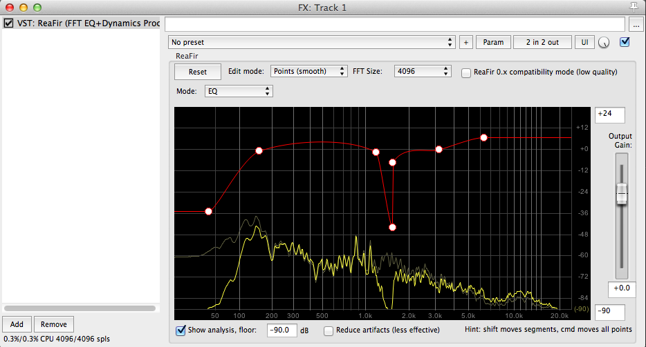
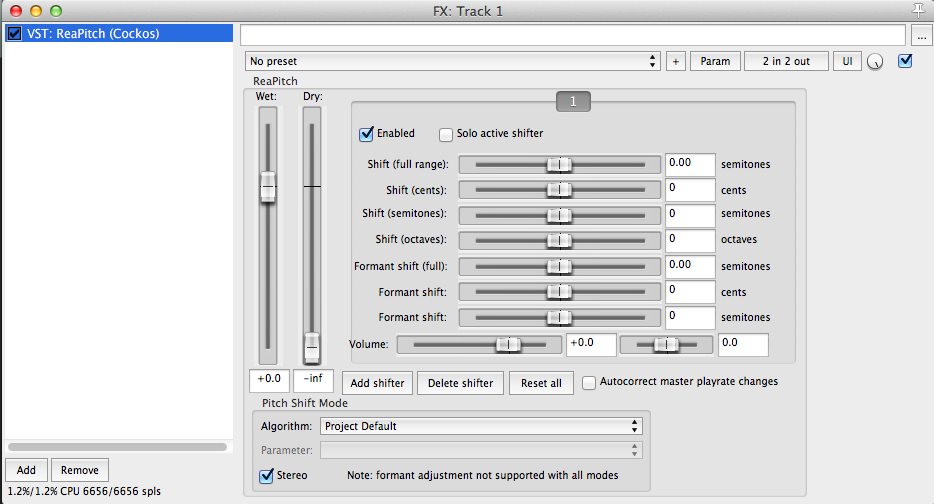
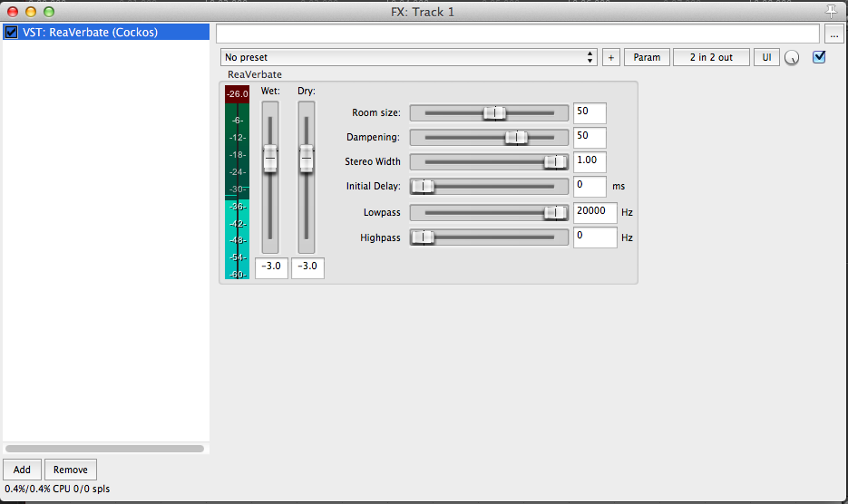
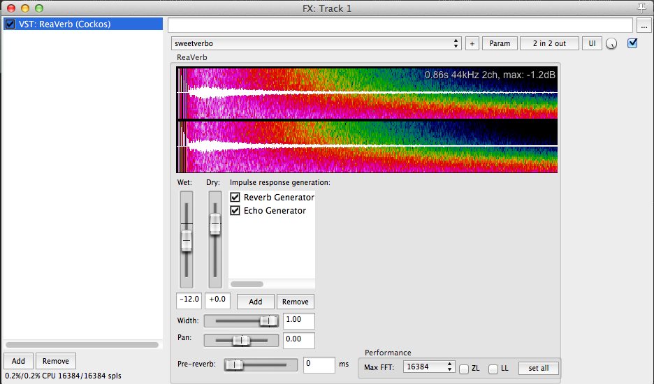
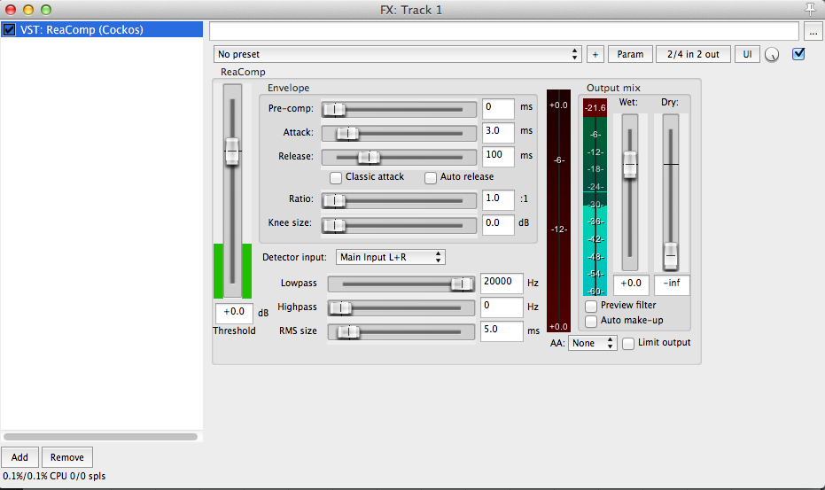
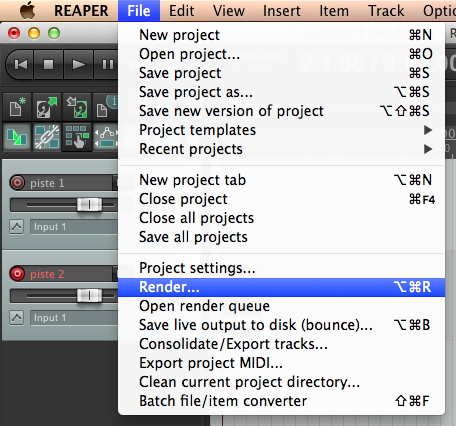
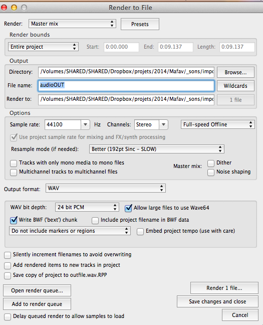

Pourquoi choisir REAPER ?:

* complet
* léger (à peine quelque mega octets)
* compatible (Mac et pc)
* flexible
* utilisation personnelle gratuite relativement «infinie»...

Site web : <a href="http://www.cockos.com/reaper/">http://www.cockos.com/reaper/</a>

## [Installation et configuration](id:install)

<a href="reaper-installation.html" target="_blank">REAPER; installation et configuration</a>

## [Interface] (id:interface)

## [La notion de *piste*](id:track)
Créer une nouvelle piste

* Via le menu
* 

* ou : En double cliquant dans un espace vacant sur la fenêtre de mix

* ou : En double cliquant dans un espace vacant sur la fenêtre à gauche de la timeline

* Configuration : entrée et sortie sonore ( notion de fréquence d'échantillonnage)
*
* Créer une nouvelle piste (différence entre audio et midi)

## [importer du son](id:import)
Importer du son (format de compression sonore (mp3 aiff wav))

* Glisser-déposer :
* Menu **Insert**/**Medias Files**

## [Opérations utiles](id:fx)

* déplacer,
* couper,
* «trimmer»,  
* naviguer dans l'interface
* modifier le volume,  
* Faire un fade,

<h2>Enregistrer</h2>

* Sélectionner la bonne piste sonore  

* Armer la piste pour l'enregistrement  

* Mettre un point d'entrée sur la timeline  

* Appuyer sur record,  espace pour arrêter.  

## [Mix](id:mix)
juxtaposer plusieurs sons sur plusieurs pistes
Panoramiser
Le principe des effets  (filtre,  compression,  réverbération)

* Filtre de fréquences (reaEQ)

* Filtre de fréquences très polyvalent (reaFir)

* Changer la hauteur du son

* Réverbération simple

* Réverbération complexe

* Compresseur

##[Exporter un fichier sonore](id:exporter)

