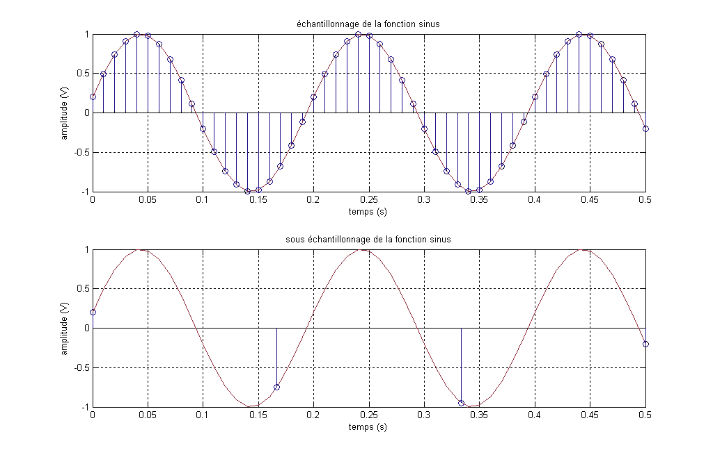

* L'échantillonnage
	* Fréquence d'échantillonnage  (hertz)
	* Profondeur de l'échantillonne (bits)

 [Fréquence d'échantillonnage : Wikipedia ](http://fr.wikipedia.org/wiki/Fréquence_d'échantillonnage)

## [Traitement numérique du son</h2>](id:daw)
### Choisir un outil pour ses fonctionnalités
* Enregistrer du son
* Importer des sons
	* Compressé (MP3, aac, etc.)
	* Non compressé (wav, aif, etc.)
* Convertir des formats de compression
* Segmenter, déplacer des morceaux
* Mixer le volume des pistes
* Appliquer des effets
	* Avoir une banque d'effet intégré
	* Appliquer les effets de manière non destructive
* Exporter des pistes
* Avoir une interface navigable
* Possibilité de travailler synchro avec de la vidéo

Listes de Station de travail audionumérique <a href="http://en.wikipedia.org/wiki/Digital_Audio_Workstation">voir DAW (Wikipedia)</a>

Notamment :

* Protool
* Logic
* Digital performer
* Reaper
* Garage Band
* Ardour
