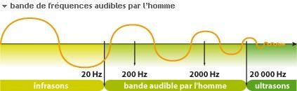
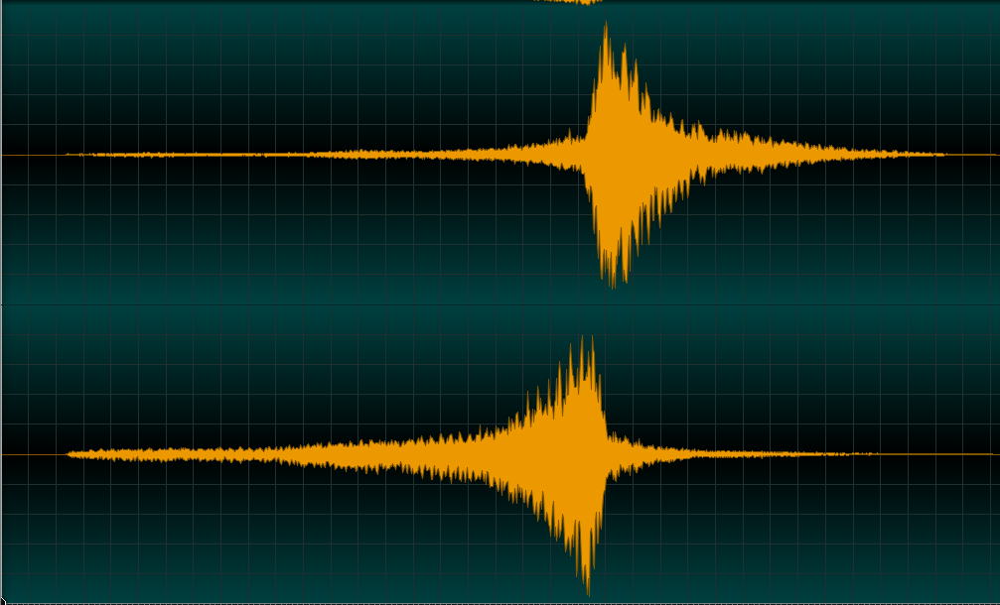

# Le son en mots
* auto-gen TOC:
{:toc}

### Intensité
Volume perçu en décibel (dB: 0 à +infini)

### Amplitude
force relative du son. (dB: -infini à 0)
Outil de visualisation : la forme d'onde (amplitude/Temps)
	

### Fréquences
Hauteur du son (pitch/note)

* 440Hz
	 <audio controls loop>
    <source src="../mp3/440.mp3" type="audio/mpeg">
    <source src="../ogg/440.ogg" type="audio/ogg">
	Your browser does not support the audio element.</audio>

* 880Hz
	 <audio controls loop>
    <source src="../mp3/880.mp3" type="audio/mpeg">
    <source src="../ogg/880.ogg" type="audio/ogg">
	Your browser does not support the audio element.</audio>  

* 1760HZ
	 <audio controls loop>
    <source src="../mp3/1760.mp3" type="audio/mpeg">
    <source src="../ogg/1760.ogg" type="audio/ogg">
	Your browser does not support the audio element.</audio>

* Sommation des trois ondes
	 <audio controls loop>
    <source src="../mp3/440+880+1760.mp3" type="audio/mpeg">
    <source src="../ogg/440+880+1760.ogg" type="audio/ogg">
	Your browser does not support the audio element.</audio>

	

### Timbre
Couleurs, sonorité, dimension qualitative du son.

* outil de visualisation : le sonogramme (Fréquences/Temps)
* exemple 1 : Sonogramme d'une voix   «cherokee» )  
	 <audio controls loop>
    <source src="../mp3/cherokee.mp3" type="audio/mpeg">
    <source src="../ogg/cherokee.ogg" type="audio/ogg">
	Your browser does not support the audio element.</audio>
	

* exemple 2 : Sonogramme d'une boucle de percussion «jongly» )  
   <audio controls loop>
    <source src="../mp3/jongly.mp3" type="audio/mpeg">
    <source src="../ogg/jongly.ogg" type="audio/ogg">
    Your browser does not support the audio element.</audio>
    

* exemple 3 :  sonogramme d'une cloche : « vibes-a1» )  
   <audio controls loop>
    <source src="../mp3/vibes-a1.mp3" type="audio/mpeg">
    <source src="../ogg/vibes-a1.ogg" type="audio/ogg">
    Your browser does not support the audio element.</audio>
    

### Rythme/ arythmie
* Rythme
 <audio controls>
  <source src="../mp3/jongly.mp3" type="audio/mpeg">
  <source src="../ogg/jongly.ogg" type="audio/ogg">
Your browser does not support the audio element. </audio>
* arythmie
 <audio controls>
  <source src="../mp3/rainstick.mp3" type="audio/mpeg">
  <source src="../ogg/rainstick.ogg" type="audio/ogg">
Your browser does not support the audio element. </audio>

### Spatialisation (Direction /provenance)
Stéréophonie

* Sans Panoramisation
   <audio controls> <source src="../mp3/rainstick.mp3" type="audio/mpeg">
	<source src="../ogg/rainstick.ogg" type="audio/ogg">
	Your browser does not support the audio element.</audio>

* Avec Panoramisation
 <audio controls>
	<source src="../mp3/rainstickPan.mp3" type="audio/mpeg">
  <source src="../ogg/rainstickPan.ogg" type="audio/ogg">
  Your browser does not support the audio element.</audio>
* Effet Doppler (phase+pitch p/r temps = impression de déplacement)
  * exemple : la sirène
  <audio controls><source src="../mp3/31920__jobro__doppler-siren.mp3" type="audio/mpeg"></audio>
	
	Source sonore : http://www.freesound.org/people/jobro/sounds/31920/		

### Dynamique et Saturation
* relation perçue entre les sons forts et les sons faibles au cours d'un morceau
	* [Guerre du volume](http://fr.wikipedia.org/wiki/Guerre_du_volume)
	
		* https://youtu.be/gSwLeLdkYjs
		* https://www.youtube.com/watch?v=Cbu7uwLqunU

### Pour aller plus loin
  * [http://fr.wikipedia.org/wiki/Psychoacoustique](http://fr.wikipedia.org/wiki/Psychoacoustique)
  * [https://fr.wikipedia.org/wiki/Son_(physique)](https://goo.gl/rsymhM)
  * [Audio : Par Mario Rossi](https://books.google.fr/books?id=n6VrGMyYtkkC&pg=PA115&hl=fr&source=gbs_toc_r&cad=3#v=onepage&q&f=false)
  * [https://fr.wikipedia.org/wiki/Effet_Doppler](https://fr.wikipedia.org/wiki/Effet_Doppler)
  * [https://fr.wikipedia.org/wiki/Acoustique](https://fr.wikipedia.org/wiki/Acoustique)
